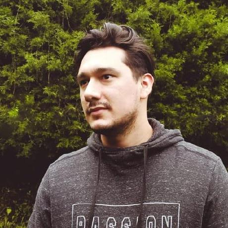

# Proyecto Águilas Cazadoras - Presentación del Equipo

--------------------------------------

## Integrantes del Grupo

---------------------------------------

## 👤 Andrés Sánchez

**Rol en la industria:** Desarrollador Frontend\
**Ubicación:** Medellín, Colombia

**Perfil:**\
Profesional enfocado en el desarrollo de interfaces interactivas modernas y
experiencias de usuario intuitivas. Cuenta con experiencia en React,
consumo de APIs y optimización de rendimiento en aplicaciones web.

**José David Morales**

Rol en la Industria: Diseñador gráfico 
Ubicación Palmira, Valle

Mi formación como profesional es múltiple en el sector TIC, como desarrollador Backend y Frontend Diseños Gráficos,
modelados 3D y editor de videos, Pero mis líneas de profundización serán en el desarrollo web y diseño gráfico. 
 